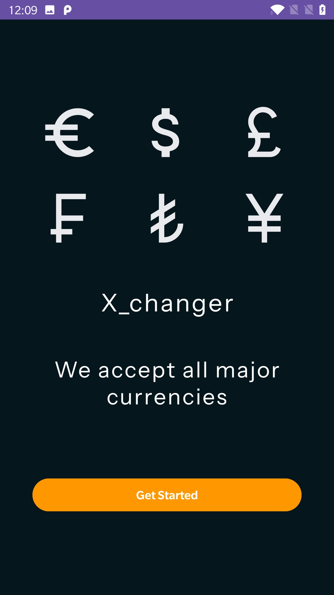
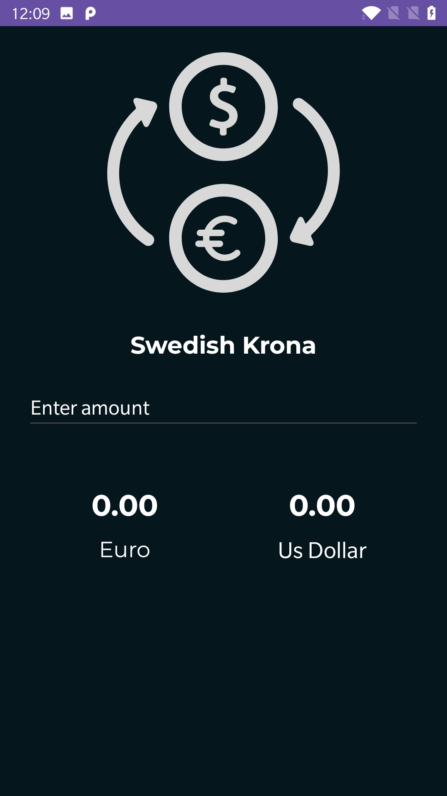
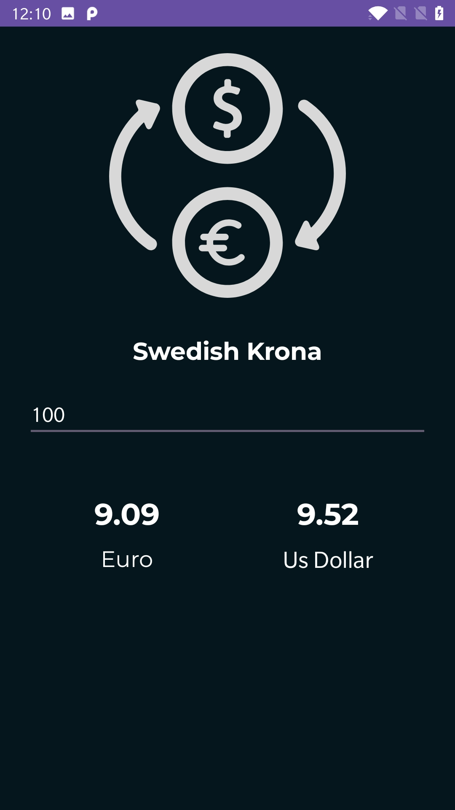

# Currency Exchange App 💱
This is an Android app built with Kotlin and XML layouts that helps users convert one currency into another. The app converts the currency value and shows the converted result instantly.

## 📌 Features
- Convert currency from SEK to Euro and USD simultaniously
- User-friendly UI designed with XML layouts
- Fast and lightweight app for smooth performance

## 🛠️ Tech Stack
- **Kotlin** – for app logic
- **XML** – for UI design
- **Android Studio** - for development

## 🚀 How It Works 
- User enters an amount in the input box
- Click OK button to continue
- The converted amount is displayed instantly

## 📷 Screenshorts

   

